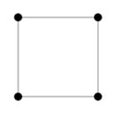
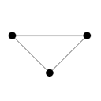
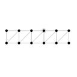
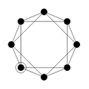
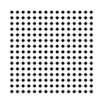
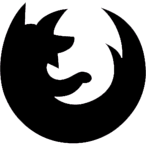
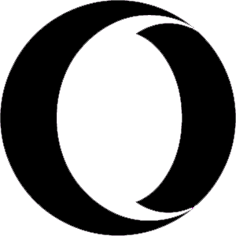

<!-- # Verlet.js -->


*Verlet.js* is a javascript library for creating rapid and fast **verlet physics** based models and structures.. Its API Is Amazing....check this out..

<!-- <a href="http://www.youtube.com/watch?feature=player_embedded&v=sA6BI2Euy-8
" target="_blank"></a> -->
[](http://www.youtube.com/watch?v=sA6BI2Euy-8)

> **``The Super Simple API``**

> **``You can create a cloth in just 3 lines of javascript``**

# Lets Get Started

## Table Of Content

- quickSetupAPI
  - quickSetup Settings
  - Create A Cloth In 3 Lines
- MainAPI Usage
  - Verlet.Poly Objects
  - Creating Your Own Models
  - Render Settings
    - Stress Rendering
- Studio API
- v1.2.0 Update
  - StudioAPI + quickSetupAPI (Thats Awesome)
  - Motion
  - showFps
- v1.2.3 Update
  - Effect
  - Verlet.renderCoords()
- v1.6.0 Update
  - Seperate stiffness and hidden Options
  - New Poly Dragging Interactions
  - Very Basic Collisions
- Browser Support

---------------------------------------

## quickSetupAPI

Lets get startup quickly with quickSetupAPI. Its very easy to use.
The code example below shows how you can use quickSetupAPI

`quickSetupAPI automatically creates a canvas and appends it to body tag for you and initialize animation loop internally, so you dont have to worry about anything.`

check out the demo [here](./demos/quickSetup_demo.html)

```javascript
  Verlet().quickSetup(function(dots,cons) {
    this.Poly.box({},dots,cons)
  },{
    renderSettings : {
      preset : 'shadowRed'
    },
    width : 1366,
    height : 768
  })
```


## quickSetup Settings

`quickSetup is amazingly fast and easy to use. we can also include some options for our verlet engine like width,height of canvas, gravity, friction, stiffness of verlet engine. and we can also pass all Render Options through renderSettings object and where we want to append the canvas.`

### Options
properties              |  type     | defaults
------------------------|-----------|----------
id                      | *String*  | 'verlet_quick_setup'
width                   | *Number*  | bodyWidth
height                  | *Number*  | bodyHeight
append                  | *Element* | document.body
gravity                 | *Float*   | 1
friction                | *Float*   | 1
stiffness               | *Float*   | 1
renderSettings          | *Object*  | {}

check out the demo [here](./demos/quickSetup_demo.html)

```javascript
//quickSetup Settings Parameters Are Optional

Verlet().quickSetup(function(dots,cons) {
    this.Poly.cloth({},dots,cons);
  },{
    renderSettings : {
      preset : 'shadowRed'
    },
    width : 500,
    height : 500,
    gravity : 0,
    friction : 0.94,
    stiffness : 0.99,
    append : document.body
  });
```


## Create A Cloth In Just ***3 Lines Of Code***

check out the demo [here](./demos/cloth_in_three_lines.html)


```javascript
  Verlet().quickSetup(function(dots,cons) {
    this.Poly.cloth({},dots,cons)
  })
```

------------------------------------------------------------------------

quickSetup API is for getting started quickly. but its *recomended* to use **MainAPI** where ***you have more control over your app***. so lets jump over to code.

## MainAPI
##### with tons of //comments

check out the demo [here](./demos/main_api_usage.html)


### `.html`

lets add our markup first.

> Just include verlet.js in head section of your markup.

> Then add a canvas with an id.

>and we are good to go.

```html
<!DOCTYPE html>
<html lang="en">
<head>
  <title>Verlet.js API Usage</title>
  <!-- Include our awesome verlet.js -->
  <script src="js/verlet.js"></script>
</head>
<body>

  <!-- canvas element with id of "c" -->
  <canvas id="c"></canvas>

</body>
</html>
```

### `.js`

Now for our javascript

> create a new instance of Verlet with **new Verlet();** and initialize with appropriate settings in **verlet.init();**

> Then we need 2 arrays you can name whatever you want, and then create a model with **verlet.Poly.box({}, dots, cons);**

> then the main loop with
> * **verlet.frame(function,color:optional)**
> * **verlet.superUpdate(dots, cons, physicsAccuracy);**
> * **verlet.superRender(dots,cons,{});** <br>
> just call **animate();** and your very first verlet.js model is good to go. now show off your friends

```javascript
//on loaded
window.onload = function() {

  //create a new instance
  const verlet = new Verlet();

  //initialize
  // verlet.init(width, height, canvasid, gravity, friction, stiffness)
  verlet.init(500,500,'#c',1,1,1);

  // need two arrays for points and constrains
  let dots = [];
  let cons = [];

  //create a box
  //verlet.Poly.box({width,height,x,y}, cons[], dots[])
  verlet.Poly.box({},dots, cons)

  //to interact with points in realtime
  verlet.Interact.move(dots);

  //main loop
  function animate() {

    //clears and updates the canvas every time
    // verlet.frame(function,bgcolor:optional);
    verlet.frame(animate);

    //update and bake physics
    //verlet.superUpdate(dots[], cons[], physicsAccuracy)
    verlet.superUpdate(dots,cons,10);

    //finally render scene objects
    //verlet.superRender(dots[], cons[], {})
    verlet.superRender(dots,cons,renderSettings{});

  }
  animate();
}
```

------------------------------------------------------------------------

## Verlet.Poly Objects

### Creating And Modifying Poly Models

check out the demo [here](./demos/poly_objects_demo.html)

### All Poly Objects
* Verlet.Poly.box({},dots,cons)
* Verlet.Poly.triangle({},dots,cons)
* Verlet.Poly.beam({},dots,cons)
* Verlet.Poly.hexagon({},dots,cons)
* Verlet.Poly.rope({},dots,cons)
* Verlet.Poly.cloth({},dots,cons)


Poly           | Preview
 ---------------|---------
Verlet.Poly.box | 
Verlet.Poly.triangle | 
Verlet.Poly.beam | 
Verlet.Poly.hexagon | 
Verlet.Poly.rope | 
Verlet.Poly.cloth | 

```javascript
...

// If You Dont Specify Any Properties The Defaults Will Be Applied

//verlet.Poly.box({x,y,width,height}, cons[], dots[])
verlet.Poly.box({
  x : 100,
  y : 100,
  width : 100,
  height : 100,
},dots, cons);

//verlet.Poly.triangle({x,y,width,height}, cons[], dots[])
verlet.Poly.triangle({
  x : 100,
  y : 100,
  width : 100,
  height : 150
},dots, cons);

//verlet.Poly.hexagon({x,y,radius,sides,slice1,slice2,center}, cons[], dots[])
verlet.Poly.hexagon({
  x : 100,
  y : 100,
  radius : 50,
  sides : 16,
  slice1 : 1,
  slice2 : 12,
  center : true
},dots, cons);

//verlet.Poly.beam({x,y,width,height,segs}, cons[], dots[])
verlet.Poly.beam({
  x : 100,
  y : 100,
  width : 50,
  height : 50,
  segs : 10,
},dots, cons);

//verlet.Poly.rope({x,y,segs,gap}, cons[], dots[])
verlet.Poly.rope({
  x : 100,
  y : 100,
  segs : 25,
  gap : 15
},dots, cons);

//verlet.Poly.cloth({x,y,segs,gap,pinRatio}, cons[], dots[])
verlet.Poly.cloth({
  x : 100,
  y : 100,
  segs : 20,
  gap : 15,
  pinRatio : 10
},dots, cons);

...
```

------------------------------------------------------------------------

## Creating Your Own Models

now hop over to creating our own models

check out the demo [here](./demos/custom_models.html)

```javascript
window.onload = function() {
  const verlet = new Verlet();
  verlet.init(500,500,'#c',1,1,1);

  let dots = [];
  let cons = [];

  // custom points
  // [[x,y,velocityX,velocityY,pinned,color]]
  // vx,vy,pinned,color is optional
  let myModel_dots = [
    [100,100],
    [200,100],
    [200,200],
    [100,200],
  ];

  //custom constrains
  // [[index,index,hidden:Boolean]]
  // hidden is optional
  let myModel_cons = [
    [0,1],
    [1,2],
    [2,3],
    [3,0],
    [3,1],
  ];

  // and then bake the arrays
  // verlet.bake(newDots[],newCons[],dots[],cons[])
  verlet.bake(myModel_dots,myModel_cons,dots,cons)

  verlet.Interact.move(dots)
  function animate() {
    verlet.frame(animate);

    verlet.superUpdate(dots,cons,25);
    verlet.superRender(dots,cons,{preset : 'shadowRed'});

  }
  animate();
}
```

------------------------------------------------------------------------

## Render Settings

> You can modify the default ugly look of your verlet engine through some render settings or presets

>In last parameter of superRender() use the settings and presets like shown below

check out the demo [here](./demos/render_settings_demo.html)

```javascript
  function animate() {
    ...

    ...

    // Tweak Render Settings
    verlet.superRender(dots,cons,{
      pointRadius : 10,
      pointColor : 'yellowgreen',
      lineWidth : 2,
      lineColor : 'green',
      renderHiddenLines : true,
      hiddenLineColor : 'red',
      hiddenLineWidth : 0.5,
      renderPointIndex : true,
      font : '12px Arial',
      fontColor : 'royalblue',
      // renderDotsAsBox : true,
      // renderStress : false,
      // debug : true,
      // preset : 'shadowRed'
    });

    ...
  }
  animate();
...
```


### Render Options You Can Tweak

just use
> ```javascript
> verlet.superRender(dots,cons,{
>   propertyName : propertyValue
> });
>```
properties              |  type     | like this
------------------------|-----------|----------
pointRadius             | *Number*  | 5
pointColor              | *String*  | 'crimson'
lineWidth               | *Number*  | 1
lineColor               | *String*  | 'deepskyblue'
fontColor               | *String*  | 'green'
font                    | *String*  | '8px Arial'
hiddenLineWidth         | *Number*  | 1
hiddenLineColor         | *String*  | 'red'
renderDots              | *Boolean* | true
renderStress            | *Boolean* | true
renderDotsAsBox         | *Boolean* | false
renderPointIndex        | *Boolean* | false
renderLines             | *Boolean* | true
renderPointHiddelLInes  | *Boolean* | false
debug                   | *Boolean* | false

------------------------------------------------------------------------

>### or if u r too lzy too typ (like me!)

>Use Render Presets

### Render Preset Names
* default
* shadowRed
* shadowPink
* shadowBlue
* shadowGreen

just use
> ```javascript
> verlet.superRender(dots,cons,{
>   preset : 'presetName'
> });
>```

### **Stress Rendering**

Stress Rendering is pretty cool.
it renders how much tension is applying on the constrains.

check out the demo [here](./demos/renderStress.html)


just use
> ```javascript
> verlet.superRender(dots,cons,{
>   renderStress : true
> });
>```
### OR
> ```javascript
> function animte() {
>  ...
>
>   verlet.stressRender(cons);
>
>  ...
> }
> animate();
> ```

------------------------------------------------------------------------

## StudioAPI

The MainAPI is cool. but we have some more magic in our pocket.
And its the `StudioAPI`

> You can also set up studio control panel and update settings in *realtime*

> The API is pretty simple its integrates with **MainAPI**

> There are two simple methods **Verlet.Studio.init()** and **Verlet.Studio.update()**

check out the demo [here](./demos/studio_demo.html)

```javascript
//StudioAPI
window.onload = function() {
  const verlet = new Verlet();
  verlet.init(650,350,'#c',1,1);

  const dots = [];
  const cons = [];

  verlet.Poly.hexagon({},dots,cons);

  // Initialize Controls and append it to a element
  verlet.Studio.init('#container');

  verlet.Interact.move(dots);
  function animate() {
    verlet.frame(animate);

    //update the studio
    //Verlet.Studio.update({dots[],cons[],renderSettings{}})
    verlet.Studio.update({
      dots : dots,
      cons : cons,
      renderSettings : {
        // optional and overwrites control panel settings
      }
    });

  }
  animate();
}
```

------------------------------------------------------------------------

# v1.2.0 Update
## StudioAPI + quickSetupAPI (Thats Awesome)

Yes!. Another Magic!
You Can Now Implement StudioPI In QuickSetupAPI.
It Makes Life More Easy..

check out the demo [here](./demos/quick_plus_studio.html)

```html
<!DOCTYPE html>
<html lang="en">
<head>
  <title>Verlet.js</title>
  <script src="./src/verlet.js"></script>
</head>
<body>
  <h2>Awesome</h2>
  <div id="ui"></div>
<script>

  // StudioAPI + quickSetupAPI
  Verlet().quickSetup(function(dots,cons) {
    this.Poly.cloth({},dots,cons);
  }, {
    initStudio : true, //init
    append : '#ui' //make sure you appends it to a separate div
  });

</script>
</body>
</html>
```
------------------------------------------------------------------------

## Motion

Well, So far so good, now jump over to automate some motion for our verlet objects.

We can set up some occilation and circular motion to our verlet points, lets have a look

check out the demo [here](./demos/verlet_motion.html)

```javascript
window.onload = function() {
  const verlet = new Verlet();
  verlet.init(600,500,'#c',1,1,1);

  let dots = [];
  let cons = [];

  verlet.Poly.rope({ x : 250 , y : 150 }, dots, cons);
  verlet.Poly.hexagon({ x : 550 , y : 160, center : true}, dots, cons);

  verlet.clamp([[14,23]],cons,dots);

  verlet.Studio.init('#container');
  verlet.Interact.move(dots);
  function animate() {
    verlet.frame(animate);

    verlet.Studio.update({
      dots : dots, cons : cons,
      renderSettings : { pointRadius : 2 },
    });

    //Verlet.Motion.occilate(index,dots[],{})
    verlet.Motion.occilate(0, dots, {
      speed : 100, //in ms
      size : 10,
      axis : 'x', // x, y, xy, yx
      timingFunction : {
        name : 'ease', // linear, ease, elastic
        amount : 1, //make it 50 for linear
        // step : 5, //only in linear
        // delay : 500 //only in elastic
      }
    });

    //Verlet.Motion.circular(index,dots[],{})
    verlet.Motion.circular(0, dots, {
      speed : 150,
      size : 5,
      // reverse : true
    });
  }
  animate();
}
```

## Motion.wind()

Adds Wind Motion To Dots ( Add It To Cloth )

check out the demo [here](./demos/verlet_Motion_wind.html)

```javascript
window.onload = function() {
  const verlet = new Verlet();
  verlet.init(700,600,'#c',1,1,1);

  let dots = [];
  let cons = [];

  verlet.Poly.cloth({
    segs : 20
  },dots, cons);


  //only adds motion to these dots
  let motionIndex = [];
  for (let i = 308; i < 399; i+=5) {
    motionIndex.push(i);
  }

  verlet.Interact.move(dots);
  function animate() {
    verlet.frame(animate);
    
    verlet.superUpdate(dots,cons,10);
    verlet.superRender(dots,cons,{renderDotsAsBox : true});

    //Verlet.Motion.wind(Array[index],Array[dots],Object{speed,size})
    verlet.Motion.wind(motionIndex,dots,{
      speed : 100,
      size : 5,
    })

  }
  animate();
}
```

------------------------------------------------------------------------

## showFps

To debug your canvas app performance you can use Verlet.showFps() method to draw a FPS Meter in canvas

### Usage With MainAPI
```javascript

function animate() {
  ...

  //Verlet.showFps({x,y,updateSpeed})
  verlet.showFps({
    x : 5, y : 5,
    updateSpeed : 3
  });

  ...
}

```
### Usage With quicksetupAPI
```javascript
  Verlet().quickSetup(function( dots, cons ) {
    this.Poly.cloth({segs : 50}, dots, cons);
  }, {
    showFps : true // or {x,y,updateSpeed}
  })
```

--------------------------------------------------------

# v1.2.3 Update

## Effect

Here We Go With A New Feature!!!;

`Verlet.Effect` Lets You Add Intresting Effects Like **BLACK HOLE!!!**,
Yes You Read It Right, You Can Add Two Type Of Effect `Black Hole` and `Blow Hole`

check out the demo [here](./demos/verlet_Effect.html)

```javascript
window.onload = function() {
  const verlet = new Verlet();
  verlet.init(600,500,'#c',1,1,1);

  let dots = [];
  let cons = [];

  verlet.Poly.cloth({
    y : 25,
    x : 100,
    gapY : 8,
    gapX : 12,
    segs : 35
  },dots, cons);


  //Specify A Circle
  let circle = {
    x : 10, y : 10,
    radius : 70,
    type : 'blow'
  }


  //Just Basic Event hadling
  document.body.addEventListener('mousemove',(e) => { circle.x = e.offsetX; circle.y = e.offsetY; })
  document.body.addEventListener('mousedown', (e) => circle.type = 'suck' )
  document.body.addEventListener('mouseup',   (e) => circle.type = 'blow' )

  verlet.Interact.move(dots);
  function animate() {
    verlet.frame(animate);
    
    verlet.superUpdate(dots,cons,25);
    verlet.superRender(dots,cons,{ renderDots : false });

    // verlet.Effect.hole(Array[],Object{});
    // Higher The Simulation Step Lower The Chance
    // The Circle Goes Inside The Cloth
    verlet.Effect.hole(dots,circle);

    //lets Draw the invisible circle too
    verlet.Draw.arc(circle.x,circle.y,circle.radius)

  }
  animate();
}

```

----------------------------------

## Verlet.renderCoords();

Verlet.renderCoords() renders the X,Y coordinates of a specific dot or all of the dots in realtime. Its makes debugging easy and created custom model more accurate by showing coords.

check out the demo [here](./demos/verlet_renderCoords.html)

```javascript
window.onload = function() {
  const verlet = new Verlet();
  verlet.init(500,500,'#c',0,1,1);

  let dots = [];
  let cons = [];

  verlet.Poly.box({},dots,cons);

  verlet.Interact.move(dots);
  function animate() {
    verlet.frame(animate);
    
    verlet.superUpdate(dots,cons,10);
    verlet.superRender(dots,cons);
    
    //Verlet.renderCoords(Array[],Array[optional])
    // if you dont specify last array it will show all the dots cooords
    // and if you specify any it will only shows that dot's coord like [0,3]
    verlet.renderCoords(dots/*[0,1]*/);

  }
  animate();
}
```

--------------------------------------------------------

# v1.6.0 Update

## Seperate Stiffness And Hidden Properties

Now You Can Seperatly Specify Constrains (cons/lines) Stiffness And It Also Takes The Hidden Attribute With It.
This Feature Adds More Control Over Constrains And You can Make More Complex Models


check out the demo [here](./demos/blob_box.html)

```javascript
window.onload = function() {
  const verlet = new Verlet();
  verlet.init(500,500,'#c',1,1,1);

  let dots = [];
  let cons = [];

  //Create A Custom Box
  verlet.create([
    [100,100],
    [200,100],
    [200,200],
    [100,200],
  ],dots,cons);
 
  verlet.clamp([
    [0,1],
    [1,2],
    [2,3],
    [3,0,   { hidden    : true }], //hidden flag
    [3,1,   { stiffness : 0.05 }], //stiffness 0-1
    [0,2,   { stiffness : 0.05 }],
  ],dots,cons);

  verlet.Interact.move(dots);
  function animate() {
    verlet.frame(animate);
    
    verlet.superUpdate(dots,cons,5);
    verlet.superRender(dots,cons,{ debug : true });

  }
  animate();
}
```

------------------------

## Verlet.Interact.drag()

`Verlet.Interact.drag()` allow you to drag Poly Objects from middle of the poly so you dont have to drag it with the dots, Its makes dragging easy. its hard to explain so jump over to the demo

check out the demo [here](./demos/verlet_interact_drag.html)

```javascript
window.onload = function() {
  const verlet = new Verlet();
  verlet.init(630,570,'#c',1,1,1);

  let dots = [];
  let cons = [];

  // Custom Object dragging
  verlet.create([
    [100,100],
    [100,200],
    [200,100]
  ], dots, cons)
  verlet.clamp([
    [0,1],
    [1,2],
    [0,2]
  ], dots, cons)

  // Register Custom Poly IDs for dragging
  verlet.PolyGroups['custom'] = [0,1,2]
  
  //Poly Objects Will Automatically Register
  verlet.Poly.box({width : 150}, dots, cons)


  verlet.Interact.move(dots);
  // Verlet.Interact.drag(array[])
  verlet.Interact.drag(dots);
  function animate() {
    
    verlet.frame(animate);
    
    verlet.superUpdate(dots,cons,10);
    verlet.superRender(dots,cons);
  
  }
  animate();
}
```


------------------------

## Verlet.Collision

`Verlet.Collision` Adds Some Very Basic Collision Detection And Hit Region Detection System

### Collision.pointToCircle()
Checks Collision Between Two Circle Or Point And Circle

check out the demo [here](./demos/verlet_collision_pointtocircle.html)


### Collision.pointInPoly()
Checks Collision Between Point And Polygon

check out the demo [here](./demos/verlet_collision_pointinpoly.html)


## Browser Support

### Modern HTML5 Enabled Browsers Are Ok Like.

Cool Logos    |    Name
--------------|-----------
 | Google Chrome
 | Mozila FireFox
 | Opera Desktop


### **Dont Event Think About Trying It On Old-IE**
* IE11 (I think? Not Tested)


## Mobile Support

  ### Tested In :
  * **Latest Google Chrome ( *supported* )**
  * UC Browser 10 ( *not supported* );


--------------------------------------------------------

## Browse [./demos](./demos) Folder To See API Usage Demos  

> ## Contact Me
> Email Me : hazru.anurag@gmail.com
> <p>I Am A : Proud Indian<p>
> <p>And Citizen Of : Kolkata<p>
